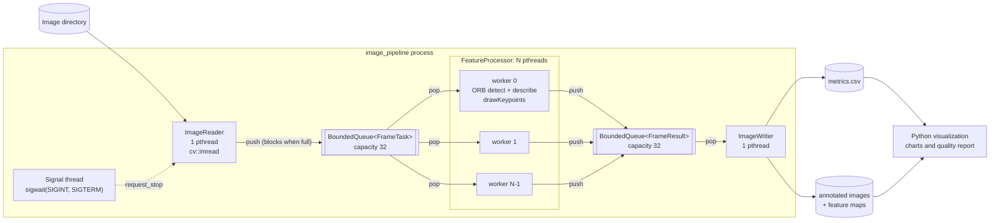

# Multithreaded Image Processing Pipeline

[](https://github.com/mihirnvad/Multithreaded-Image-Processing-Pipeline/actions/workflows/ci.yml)


A C++17 pipeline that extracts ORB features from image datasets. POSIX threads run the three stages in parallel: **read**, **process** and **write**. Bounded, mutex-protected queues connect them. A Python module generates test data, benchmarks the pipeline and renders the feature maps plus processing and image-quality statistics.

**Result: 3.69× the throughput of sequential processing** (5.32 → 19.65 images/s) with 8 worker threads on a 4-core laptop. The parallel output matches the sequential run for every image, and the tests run clean under ThreadSanitizer.

| | Sequential baseline | Pipeline, 8 workers |
|---|---:|---:|
| Wall time (200 images, 1920×1080 JPEG) | 37.6 s | 10.2 s |
| Throughput | 5.32 images/s | **19.65 images/s (3.69×)** |
| End-to-end latency p50 / p99 | 172 / 437 ms | 143 / 283 ms |
| Images per worker | — | 25 25 26 25 25 25 24 25 |

<sub>Intel Core i5-1035G7 (4 cores / 8 threads, 15 W), Ubuntu 24.04 on WSL2, GCC 13 `-O3`, OpenCV 4.6, ORB with 1,000 features per image. Single run of each mode on a laptop, so expect a few percent of variation. Reproduce with <code>scripts/benchmark.py</code>.</sub>

---

## Architecture



| Stage | Threads | What it does |
|---|---|---|
| `ImageReader` | 1 | Recursively lists the input directory (sorted, so runs are reproducible) and decodes each image with `cv::imread`. It timestamps each frame and pushes a `FrameTask`. When the listing runs out, or a stop is requested, it closes the input queue. |
| `FeatureProcessor` | N | Each worker owns its own `cv::ORB` detector and scratch buffers. It converts the frame to grayscale and runs `detectAndCompute` (1,000 features, 256-bit descriptors). It computes image-quality statistics (sharpness, brightness, contrast), draws the keypoints in green, and can optionally render a keypoint-density heat map. |
| `ImageWriter` | 1 | The only thread that touches the file system for output. It saves the annotated images and feature maps and appends one CSV row per image, timed to the microsecond. |
| `Pipeline` | coordinator | Wires the stages together, starts the threads (consumers first), joins them in dependency order and collects the statistics. |

### How the concurrency works

**Bounded blocking queue** ([`include/BoundedQueue.hpp`](include/BoundedQueue.hpp)). A generic `BoundedQueue<T>` built from one `std::mutex` and two condition variables, `not_empty_cv_` and `not_full_cv_`:

- **Backpressure.** `push()` blocks while the queue is full. If workers fall behind, the reader stalls instead of decoding the whole dataset into RAM. At most `2 × queue-size + N` frames are in memory at once, whatever the dataset size.
- **Graceful shutdown.** `close()` wakes every waiting thread. After close, `push()` returns `false`, and `pop()` keeps returning buffered items until the queue is empty, then returns `std::nullopt`. So "closed and drained" is an unambiguous end-of-stream signal, and no in-flight frame is lost.
- **Precise wake-ups.** Producers only notify `not_empty_cv_` and consumers only notify `not_full_cv_`, with notifications sent after the lock is released. Nobody wakes up only to block on a mutex that is still held.

**Shutdown order, with no deadlock possible.** Each queue is closed by exactly one party, and only after all of that queue's producers are done:

1. The reader finishes and closes the input queue.
2. Each worker sees "closed and drained" on the input queue and exits. The coordinator joins all workers, then closes the output queue.
3. The writer drains the output queue, flushes `metrics.csv` and exits.

**POSIX threads** ([`include/PosixThread.hpp`](include/PosixThread.hpp)). Every thread is a real `pthread_create`/`pthread_join` thread behind a small RAII wrapper:

- Threads are named with `pthread_setname_np` (`reader`, `worker-3`, `writer`), so they show up by name in `top -H`, `gdb` and `perf`.
- The destructor joins rather than calling `std::terminate`, so a thread can't be leaked if an exception unwinds past its owner.

**Ctrl+C handling** ([`ScopedSignalHandler`](include/Pipeline.hpp)):

- `SIGINT` and `SIGTERM` are blocked with `pthread_sigmask` before any other thread starts, so every thread inherits the mask.
- A dedicated thread receives these signals synchronously with `sigwait`. The stop logic therefore runs as ordinary code, not inside an async-signal handler.
- The first Ctrl+C stops the reader at the next image boundary; frames already in flight still get processed and written. A second Ctrl+C exits immediately with code 130.

**No copies of pixel data.** `cv::Mat` is a reference-counted header, and frames are `std::move`d through both queues, so each decoded buffer is handed from thread to thread without being copied. Keypoints are drawn in place on the frame's own buffer, which saves allocating and copying a second full-resolution image per frame.

**No locks on the hot path.** Each worker owns its detector and buffers, and only the writer thread touches the CSV file. The queues are the only shared state, costing one short critical section per image per queue.

---

## Correctness

| Check | What it proves |
|---|---|
| [`tests/test_queue.cpp`](tests/test_queue.cpp) | **16 producers and 16 consumers (32 threads) move 100,000 uniquely numbered items** through queues of capacity 1, 8, 64 and 1024. Every item must arrive exactly once. Also covers backpressure (a producer stalls exactly at capacity), `close()` waking blocked producers and consumers, draining after close, per-producer FIFO order, move-only types, and shutdown under load. A watchdog aborts on any deadlock. |
| [`tests/test_pipeline.cpp`](tests/test_pipeline.cpp) | Runs the whole pipeline with 1 to 16 workers and queue capacities from 1 to 32. Checks that **every image's keypoint count matches the sequential baseline**, with none dropped or duplicated, that a corrupt file is skipped rather than fatal, that output files are written, and that a stop request shuts down cleanly. |
| ThreadSanitizer (`-DENABLE_TSAN=ON`) | Both test suites finish with **zero reports** against this repository's code. [`tests/tsan.supp`](tests/tsan.supp) suppresses only GDAL's static initializers, which `libopencv_imgcodecs` pulls in and which run before `main()`. |
| AddressSanitizer + UBSan (`-DENABLE_ASAN=ON`) | Both suites run clean, with leak detection on. |
| Compiler | Builds with `-Wall -Wextra -Wpedantic -Wshadow -Wconversion -Werror` on GCC and Clang. |

---

## Quickstart

### Dependencies (Ubuntu 22.04 / 24.04)

```bash
sudo apt-get install -y build-essential cmake ninja-build libopencv-dev python3-numpy python3-opencv python3-matplotlib
```

For sanitizer builds with Clang, also install `clang libclang-rt-dev`. The Python tooling can also be installed with `pip install -r scripts/requirements.txt`.

### Build and test

```bash
cmake -S . -B build -G Ninja -DCMAKE_BUILD_TYPE=Release
cmake --build build
ctest --test-dir build --output-on-failure
```

ThreadSanitizer build:

```bash
CXX=clang++ cmake -S . -B build-tsan -G Ninja -DCMAKE_BUILD_TYPE=Debug -DENABLE_TSAN=ON
cmake --build build-tsan
TSAN_OPTIONS="halt_on_error=1 suppressions=$PWD/tests/tsan.supp" ./build-tsan/test_queue
TSAN_OPTIONS="halt_on_error=1 suppressions=$PWD/tests/tsan.supp" ./build-tsan/test_pipeline
```

AddressSanitizer + UndefinedBehaviorSanitizer: use `-DENABLE_ASAN=ON` in a separate build directory.

### Run

```bash
python3 scripts/generate_synthetic_dataset.py --count 200 --output data/test_set
./build/image_pipeline --input data/test_set --output out --feature-maps --threads 8
```

| Flag | Default | Description |
|---|---|---|
| `-i, --input <dir>` | required | Input directory, searched recursively (jpg, png, bmp, tiff, webp, ppm, pgm) |
| `-o, --output <dir>` | off | Save annotated images (`*_keypoints.jpg`) |
| `-F, --feature-maps` | off | Also save keypoint-density heat maps (`*_featuremap.jpg`); needs `--output` |
| `-t, --threads <n>` | hardware concurrency | Number of worker threads |
| `-q, --queue-size <n>` | 32 | Capacity of each bounded queue |
| `-m, --metrics <file>` | `metrics.csv` | Per-image metrics CSV |
| `-f, --features <n>` | 1000 | ORB features per image |
| `-s, --sequential` | off | Single-threaded baseline: same code, no queues, no worker threads |
| `-n, --limit <n>` | all | Process at most *n* images |
| `-j, --json` | off | Print the run summary as one JSON line (used by `benchmark.py`) |

Each row of `metrics.csv` records `sequence`, `filename`, `worker_id`, `width`, `height` and `num_keypoints`. It also records per-stage timings in milliseconds to three decimals (`read_time_ms`, `queue_wait_ms`, `process_time_ms`, `output_wait_ms`, `write_time_ms`, `total_latency_ms`) and the image-quality statistics `sharpness` (variance of the Laplacian), `brightness` and `contrast`.

### Benchmark and visualize

```bash
python3 scripts/benchmark.py --binary build/image_pipeline --data data/test_set --repeats 5
python3 scripts/visualize_metrics.py --results results --images out --data data/test_set --out assets
```

Or run everything (dataset, benchmark, annotated output and charts) with one script, `./scripts/run_all.sh`, or with Docker:

```bash
docker build -t image-pipeline .
docker run --rm -v "$PWD/results:/app/results" -v "$PWD/assets:/app/assets" image-pipeline
```

The Docker build stage compiles the project and runs the test suite, including the ThreadSanitizer builds, so a successful `docker build` means the tests passed.

---

## Python tooling

| Script | Purpose |
|---|---|
| [`generate_synthetic_dataset.py`](scripts/generate_synthetic_dataset.py) | Generates reproducible (seeded) 1920×1080 JPEGs containing gradients, sensor-like noise, checkerboards, shapes, polygons, line fields and text, all rich in corners for ORB. About 15% are deliberately **blurred, under-exposed or low-contrast**, and `manifest.csv` records which, so the quality report can be checked against known defects. |
| [`benchmark.py`](scripts/benchmark.py) | Runs the sequential baseline and 1/2/4/8/16 workers. Repeats are interleaved **round-robin**, so thermal drift and background load are spread across all configurations. Reports best-of-N and median wall-clock time, throughput, speedup and parallel efficiency to `benchmark_summary.csv`, and records the CPU in `system_info.json`. |
| [`visualize_metrics.py`](scripts/visualize_metrics.py) | Renders the charts listed below. |

Charts written by `visualize_metrics.py`:

| Chart | Shows |
|---|---|
| `speedup_vs_amdahl.png` | Measured speedup against ideal linear scaling and a fitted Amdahl curve, with the physical-core and logical-CPU counts marked |
| `throughput.png` | Images per second for each configuration |
| `latency_percentiles.png` | Box plots of per-image processing time and end-to-end latency, with p50, p95 and p99 marked |
| `stage_breakdown.png` | Where each image's time goes: read, queue wait, processing, output wait, write |
| `image_quality.png` | Keypoints against sharpness, exposure scatter and keypoint distribution. Prints the flagged images and how many of the deliberately degraded images were caught. |
| `feature_maps.png` | Gallery of the original image, its ORB keypoints and its keypoint-density heat map, for the richest, median and weakest images |

Commit the generated `assets/` directory to embed the charts in this README.

---

## Performance analysis: why the speedup levels off near 3.7×

**1. The single reader thread is the serial fraction (Amdahl's law).** In the sequential run, each image takes about 172 ms end to end (p50). About 126 ms of that is ORB, annotation and quality statistics. The remaining ~46 ms is reading and decoding a noisy 1080p JPEG on one thread.

- The workers parallelize the 126 ms, but decoding happens only in the reader.
- In a pipeline, throughput is capped by the slowest serial stage: 1 / 46 ms ≈ **22 images/s**.
- The pipeline reached **19.65 images/s**, about 90% of that ceiling. Equivalently, a serial fraction of ~27% gives an Amdahl limit of about 1 / 0.27 ≈ 3.7×, which is where the measured speedup sits.

**2. Physical cores versus hyper-threads.** The CPU has 4 physical cores and 8 hardware threads. Workers beyond 4 share execution units, so they add much less than a full core each. On a 15 W laptop part, heavier all-core load also lowers the clock through power and thermal limits.

**3. Memory bandwidth.** Each decoded frame is about 6 MB (1920 × 1080 × 3 bytes). Grayscale conversion, the Laplacian, ORB's image pyramid and annotation each stream over it several times, so many parallel workers compete for the same memory bandwidth and last-level cache.

**4. Lock contention is not the bottleneck.** Each image costs one lock acquisition per queue against about 100 ms of computation. The stress test moves 100,000 items through a single queue with 32 contending threads in about 3 seconds, tens of thousands of hand-offs per second, while the pipeline needs about 20 per second. The even per-worker split (24–26 images each) also shows workers aren't starving each other.

**What would raise the ceiling:**

- Have the reader load raw bytes and let the workers decode with `cv::imdecode`. This moves the largest serial cost into the parallel stage.
- With `--output` enabled, JPEG encoding in the single writer thread becomes the next serial stage. Encoding could move into the workers, or the writer could be widened to a small pool.
- ORB could be pinned to per-core threads, or the image pyramid computed at reduced resolution.

---

## Repository layout

```
├── CMakeLists.txt              Build, -DENABLE_TSAN / -DENABLE_ASAN, -DWARNINGS_AS_ERRORS
├── Dockerfile                  Multi-stage: build + test (incl. TSan), then slim runtime
├── .github/workflows/ci.yml    GCC, Clang, TSan and ASan+UBSan jobs, plus a smoke benchmark
├── include/
│   ├── BoundedQueue.hpp        Generic bounded blocking queue (mutex + 2 condition variables)
│   ├── PosixThread.hpp         RAII pthread wrapper with thread names
│   ├── Types.hpp               FrameTask / FrameResult contracts, monotonic clock
│   ├── ImageReader.hpp         Stage 1: producer
│   ├── FeatureProcessor.hpp    Stage 2: worker pool + per-thread ORB kernel
│   ├── ImageWriter.hpp         Stage 3: consumer, CSV metrics
│   └── Pipeline.hpp            Coordinator, config/stats, sigwait signal handler
├── src/                        Implementations + main.cpp (getopt_long CLI)
├── tests/
│   ├── test_queue.cpp          32-thread / 100k-item stress test, shutdown semantics
│   ├── test_pipeline.cpp       Parallel == sequential equivalence, end-to-end
│   └── tsan.supp               Third-party-only TSan suppressions
└── scripts/
    ├── generate_synthetic_dataset.py
    ├── benchmark.py
    ├── visualize_metrics.py
    ├── run_all.sh
    └── requirements.txt
```
